# Penjelasan Game The Survivalist

  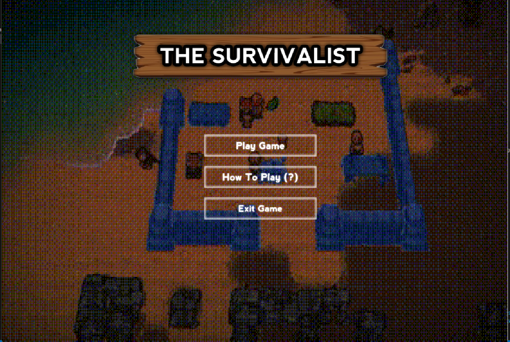
  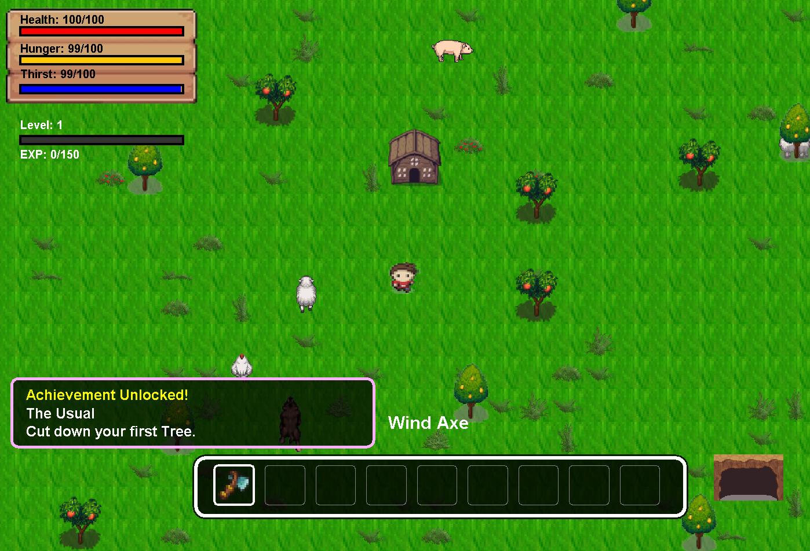

The Survivalists adalah sebuah game petualangan yang mengusung elemen bertahan hidup. Dalam permainan ini, pemain akan menjelajahi sebuah pulau terpencil yang dipenuhi misteri dan berbagai tantangan. Tujuan utama dari permainan ini adalah untuk bertahan hidup dengan memanfaatkan sumber daya yang tersedia di sekitar lingkungan.

Pemain dapat mengumpulkan bahan-bahan alam, membangun tempat tinggal, membuat peralatan, serta menghadapi berbagai ancaman yang muncul di pulau. Aktivitas seperti berburu, memancing, dan bercocok tanam menjadi bagian penting untuk memenuhi kebutuhan hidup karakter.

Selain itu, The Survivalists juga menawarkan berbagai fitur menarik seperti kemampuan untuk membangun struktur, bertarung melawan musuh, dan mengumpulkan berbagai barang untuk menunjang kelangsungan hidup. Semua elemen ini berpadu untuk menciptakan pengalaman bermain yang seru, menantang, dan penuh eksplorasi.

# Struktur Class Utama

  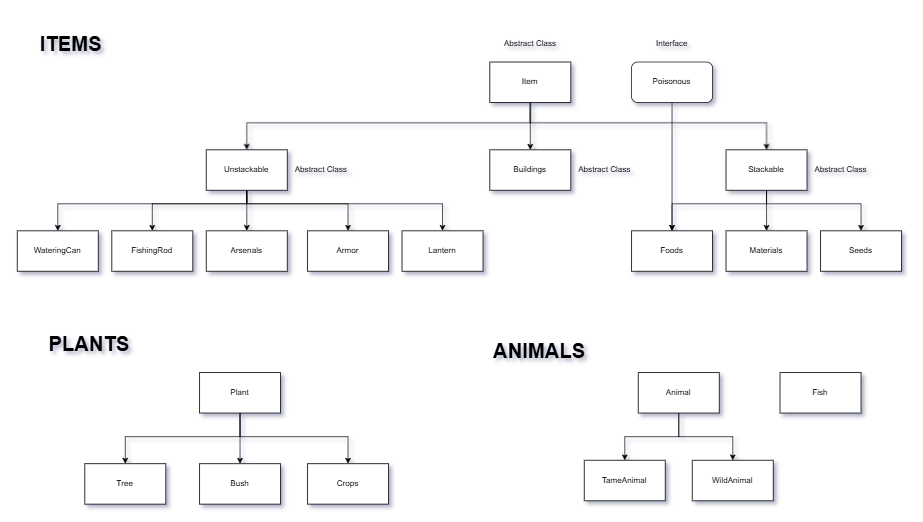

Berikut adalah gambaran struktur class utama yang ada dalam game ini class yang digambarkan di atas merupakan abstract class dari object - object lainnya yang ada dalam game ini.
Ada juga class - class lain seperti GamePanel, KeyHandler, Player, Environtment, Lighting, UI, dan sebagainya akan tetapi disini mereka bukan berupa abstract class atau class yang berdiri sendiri.

# Fitur Game
Memancing
Dibuka saat pemain mencapai level 15. Pemain dapat memancing di area perairan untuk mendapatkan ikan

Toko (Shop)
Dapat diakses ketika pemain mencapai level 20. Di sini, pemain bisa membeli dan menjual berbagai item untuk menunjang petualangan.

Gua (Cave)
Area eksplorasi yang dapat diakses kapan saja. Di dalam gua, pemain mungkin menemukan musuh, harta karun, atau sumber daya langka.

Tidur
Pemain dapat menggunakan item tempat tidur untuk beristirahat, yang berfungsi mengembalikan energi atau menyimpan progress (jika berlaku dalam sistem game).

Menebang Pohon
Aktivitas yang memungkinkan pemain memperoleh kayu sebagai sumber daya, biasanya menggunakan alat seperti kapak.

Berburu Hewan
Pemain dapat menyerang dan membunuh hewan liar untuk mendapatkan daging, kulit, atau bahan lainnya.

Diserang oleh Hewan
Beberapa hewan di alam liar bersifat agresif dan dapat menyerang pemain, sehingga perlu diwaspadai.

Kelaparan dan Kehausan
Pemain harus menjaga tingkat energi dan hidrasi. Jika dibiarkan terlalu lama lapar atau haus, hal ini dapat memengaruhi kesehatan atau performa karakter.

Menernak dan Mengawinkan Hewan
Pemain memelihara hewan untuk mendapatkan sumber daya tambahan

# Controller Player
W → Menggerakkan pemain ke arah atas

A → Menggerakkan pemain ke arah kiri

S → Menggerakkan pemain ke arah bawah

D → Menggerakkan pemain ke arah kanan

F → Berpindah antara wilayah daratan dan lautan

C → Membuka menu crafting untuk membuat item dan peralatan

I → Membuka inventory untuk melihat dan mengelola barang yang dimiliki pemain

1 - 9 → Memilih item yang ingin digunakan sesuai dengan slot yang sedang dibawa pemain

S (saat dalam mode chest/inventory) → Menukar atau memindahkan item antara chest dan inventory

E → Digunakan untuk menyerang musuh, menebang pohon, dan menghancurkan bangunan

T → Masuk dan keluar dari bangunan kandang

G → Mengangkat dan memindahkan hewan

Q → Menjatuhkan item ke world dengan jumlah yang bisa ditentukan untuk stackable items

CAPS_LOCK → Membuka menu achievement

↓ (Tombol Panah Bawah) (saat dalam mode kandang) → Digunakan untuk memilih aksi seperti menghapus hewan, mengawinkan hewan, atau mengambil hasil ternak

Enter (saat dalam mode kandang) → Konfirmasi atau menyetujui aksi yang dipilih

Spasi (Spacebar) → Masuk dan keluar dari toko (Shop) serta menjelajahi atau keluar dari gua (Cave)

# Inventory
<h3>A. Struktur Class </h3>

  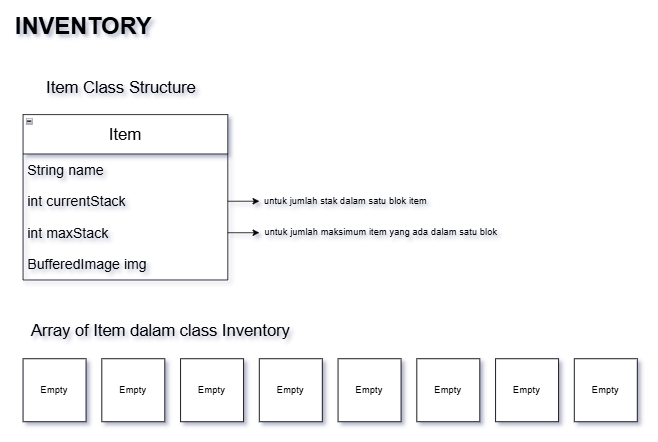

<h3>B. Cara Kerja Add Items </h3>

  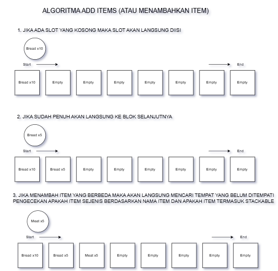
   
  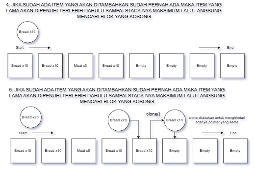

<h3>C. Cara Kerja Remove Items </h3>

  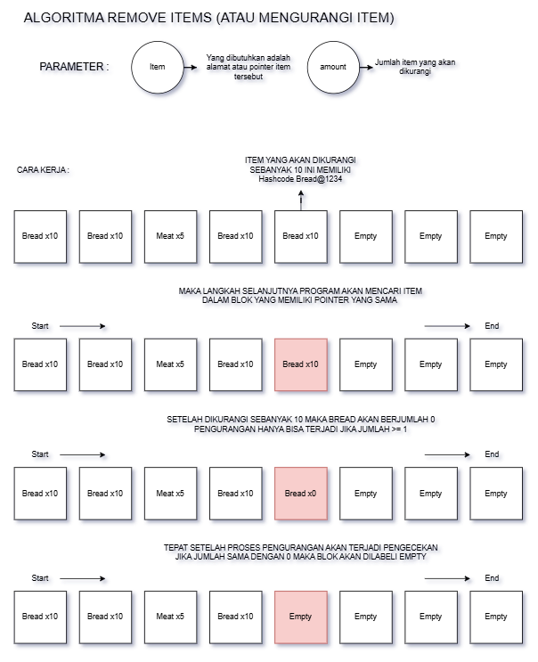

# Item Drop
<h3>Cara Kerja </h3>

  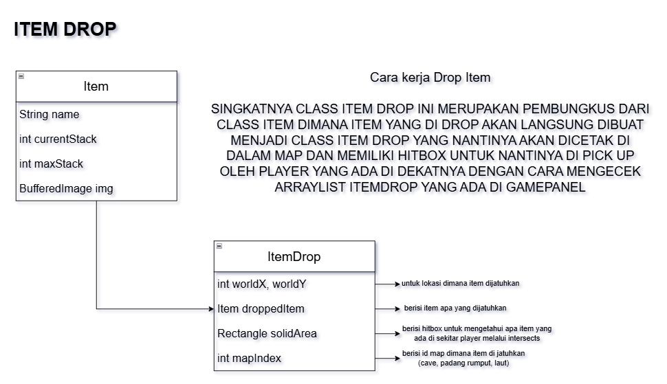
  

    Singkatnya sesuai dengan gambar di atas Item yang di drop itu merupakan item yang dibungkus ke dalam class ItemDrop yang kemudian akan
    digambar saat repaint() di dalam class ItemDrop ada objek Rectangle solidArea yang nantinya akan di cek hitbox nya dalam class CollisionChecker
    
  

# 🛠️ Crafting
<h3>A. Cara Kerja Resep </h3>

  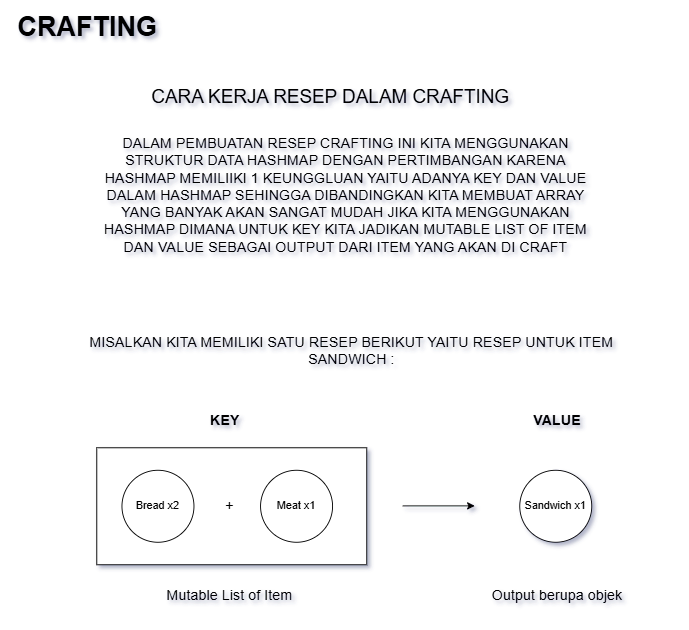

<h3>B. Cara Kerja Crafting </h3>

  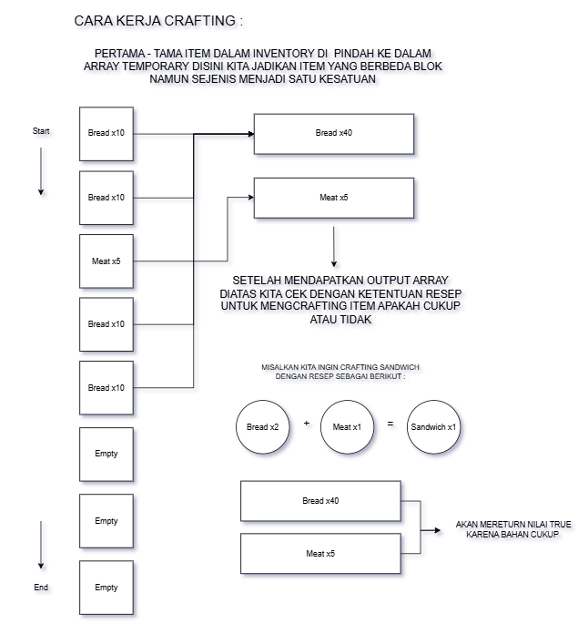
   
  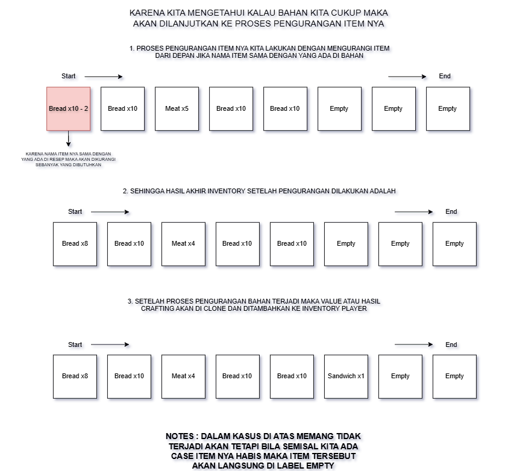

